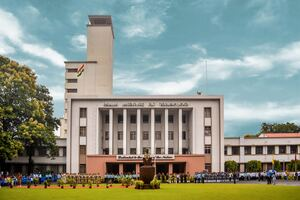
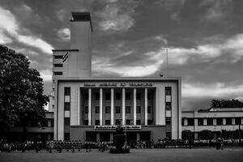
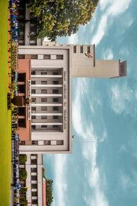
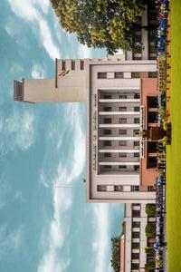
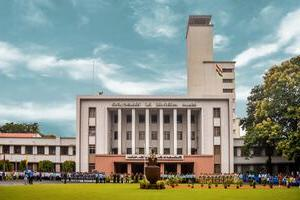
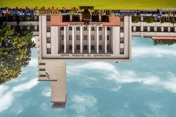
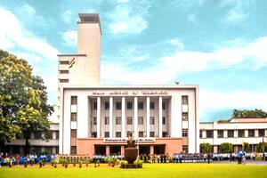
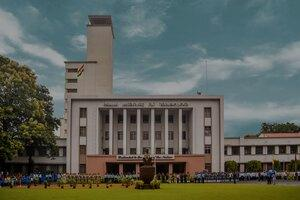

# Java Image Editor

Welcome to the Java Image Image_Editor – your all-in-one solution for image enhancement. This tool simplifies image manipulation with features such as grayscale conversion, rotation, brightness adjustment, inversion, and pixelated or Gaussian blur. Elevate your image editing game today and explore endless creative possibilities.

ORIGINAL IMAGE : 

## Features

- *Convert to Grayscale:* Transform colored images into grayscale.
  
  

- *Rotate:* Rotate images 90 degrees clockwise.
  
  

- *Rotate:* Rotate images 90 degrees anticlockwise.

  

- *Horizontal Invert:* Flip images horizontally.
  
  

- *Vertical Invert:* Flip images vertically.
  
  

- *Adjust Brightness:* Increase image brightness.
  
  

- *Adjust Brightness:* Decrease image brightness.

  

- *Blur Images:* Blur an image.

  
  

## Getting Started

Follow these steps to get started with the Java Image Editor:

### Prerequisites

- Java Installed on the device
- Any Java IDE.
- An Image.
### Libraries Needed:-
  - java.awt.Color;
  - java.awt.image.BufferedImage;
  - java.io.File;
  - java.io.IOException;
  - java.util.*;
  - javax.imageio.ImageIO;

    
# All the Functions Explanations:-

1) GrayScaling : Here I First get the height and width of the image which i need to edit. Then I used a nested for loop for getting the particular pixel values of the image, then I set the all the pixel values to the new bufferred image where I particularly used the in-built function of 'BufferredImage.TYPE_BYTE_GRAY'. This runs and successfully creates a result image in the current working directory.
   
2) RotateClockwise : Here I First get the height and width of the image which i need to edit. Then I created a new bufferred Image in which I append the new changes. Then I used a nested for loop for getting the particular pixel values of the image, then I set the all the pixel values and set the columns and rows values in the new bufferred image and gave it the pixel values of the image rows and columns. This runs and successfully creates a result image in the current working directory with name rotatedImage.jpg.

3) PrintRGBValues : Here I First get the height and width of the image which i need to edit. Then I created a new bufferred Image in which I append the new changes. Then I used a nested for loop for getting the particular pixel values of the image. Here the values which i get is of 32 bits out of which the first 8 bits are red pixel values and next 8 is of blue and next 8 of green and last 8 is the tranparency value. We cannot access these values directly so we use the color object to get those values. Color object have a method called 'getRed()' which gives the first 8 bits of the long 32 bits, similarly we can use the inbuilt functions to get the values of blue, green, transparency.

4) VerticalInvert : Here I First get the height and width of the image which i need to edit. Then I created a new bufferred Image in which I append the new changes. Then I used a nested for loop for getting the particular pixel values of the image, then i set the values according to the need in the new bufferred image. This runs and successfully creates a result image in the current working directory with name VerticallyrotatedImage.jpg.

5) HorizontallyInvert : Here I First get the height and width of the image which i need to edit. Then I created a new bufferred Image in which I append the new changes. Then I used a nested for loop for getting the particular pixel values of the image, then i set the values according to the need in the new bufferred image. This runs and successfully creates a result image in the current working directory with name HorizontallyrotatedImage.jpg.

6) ChangeBrightness : Here I First get the height and width of the image which i need to edit. Then I created a new bufferred Image in which I append the new changes. Then I asked the user to enter the percent of brightness to increase between 1 to 100. After which I increased the red, green and blue pixel values by that much percent and if it exceeds 255 then i set it to 255 and similarly if it decreases from 0 then i set i to 0.This runs and successfully creates a result image in the current working directory with name changebright.jpg.

# Usage
- Open the project in your favorite Java IDE (e.g., Eclipse, IntelliJ IDEA).

- Run the ImageEditor.java file.
- You will be presented with a menu of options:
- Convert to Grayscale: Converts the image to grayscale and saves it.
- Rotate: Rotates the image 90 degrees clockwise and saves it.
- Horizontal Invert: Flips the image horizontally and saves it.
- Vertical Invert: Flips the image vertically and saves it.
- Adjust Brightness: Adjusts the image brightness and saves it.
- Exit: Quits the image editor.
- Follow the on-screen instructions to perform the desired operation on your image.
- After selecting the option the result image would be saved in the current working directory.
  

# Code Snippets :

# Code Explanation:- 
This whole code works in the Command Line. I have used the infinite while loop for the editing functions. On running the code it asks for selecting one of the 7 options which we have to type in the output terminal. Once we select the option, the particular function gets called and gives the output. The output Image gets saved in the current working directory, which we can access through navigating to that folder from the file manager or from your working IDE. This runs infinitely until we choose the option '0' which is the only way to break the loop and come out of the code.

# OUTPUT OF THE CODE :

__________________________________________________________

Enjoy image editing with Java!

